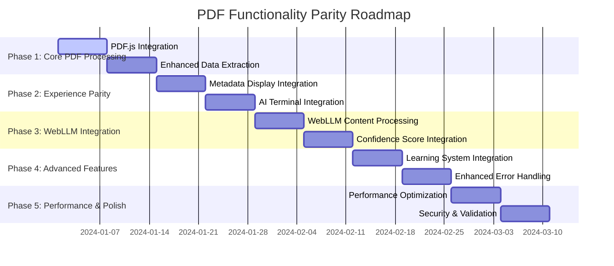

# PDF Functionality Parity Roadmap

## Executive Summary

This roadmap details the implementation path to bring PDF input functionality to full parity with URL input in the Ghost Job Detector application. The current PDF implementation is a basic mock that needs complete overhaul to match the sophisticated URL processing pipeline.

## Current State vs Target State

| Feature              | Current PDF     | Target PDF | URL Reference |
|----------------------|-----------------|------------|---------------|
| PDF Parsing          | Mock FileReader | Real PDF.js integration | N/A |
| Metadata Display     | None            | Live streaming | ✅ MetadataIntegration |
| AI Terminal          | None            | Real-time logs | ✅ AIThinkingTerminal |
| WebLLM Processing    | Bypassed        | Full pipeline | ✅ WebLLM integration |
| Learning Integration | None            | Failure learning | ✅ ParsingLearningService |
| Error Handling       | Basic           | Rich guidance | ✅ Platform-specific errors |
| Progress Feedback    | None            | Multi-stage | ✅ Multiple indicators |
| Confidence Scoring   | None            | Multi-level | ✅ Parser confidence |

---

## Phase 1: Core PDF Processing Infrastructure (Weeks 1-2)

### 1.1 PDF.js Integration (Week 1) 
**Priority: Critical** • **Effort: High** • **Risk: Medium**
#### Implementation Tasks
```typescript
// 1. Install PDF.js dependency
npm install pdfjs-dist

// 2. Create PDFParsingService
src/services/parsing/PDFParsingService.ts
```

#### Core Components
- **PDFTextExtractor**: Extract all text content from PDF
- **PDFMetadataExtractor**: Extract headers, footers, and document info
- **PDFURLDetector**: Intelligent URL detection in PDF content
- **PDFValidationService**: Validate PDF structure and content

#### Technical Architecture
```typescript
class PDFParsingService {
  async extractJobData(file: File): Promise<PDFJobData> {
    // 1. Load PDF with PDF.js
    const pdf = await pdfjsLib.getDocument(arrayBuffer).promise
    
    // 2. Extract text from all pages
    const textContent = await this.extractAllText(pdf)
    
    // 3. Detect URLs in headers/footers
    const urls = await this.detectURLs(textContent)
    
    // 4. Extract job information
    const jobData = await this.parseJobInfo(textContent, urls)
    
    // 5. Generate confidence scores
    return this.addConfidenceScoring(jobData)
  }
}
```

#### Success Criteria
- ✅ Real PDF text extraction working
- ✅ URL detection from headers/footers functional  
- ✅ Basic job information parsing operational
- ✅ Error handling for corrupted/invalid PDFs

### 1.2 Enhanced Data Extraction (Week 2)

**Priority: Critical** • **Effort: Medium** • **Risk: Low**

#### Advanced Parsing Features
- **Smart URL Detection**: Multiple strategies for finding job URLs
- **Content Structure Analysis**: Identify job sections (title, description, requirements)
- **Company Information Extraction**: Logo detection, company name parsing
- **Date and Location Parsing**: Posting dates and job locations

#### Implementation Details
```typescript
interface PDFJobData {
  title: string
  company: string
  description: string
  location?: string
  remoteFlag?: boolean
  postedAt?: Date
  sourceUrl?: string
  confidence: {
    title: number
    company: number
    description: number
    url: number
    overall: number
  }
  parsingMetadata: {
    pdfPages: number
    textLength: number
    urlsFound: string[]
    parsingMethod: string
    processingTimeMs: number
  }
}
```

---

## Phase 2: Experience Parity Integration (Weeks 3-4)

### 2.1 Metadata Display Integration (Week 3)

**Priority: High** • **Effort: Medium** • **Risk: Low**

#### MetadataIntegration Connection
```typescript
// Update JobAnalysisDashboard.tsx
const onSubmitPdf = async (data: PdfAnalysisForm) => {
  // Connect to metadata system
  setCardVisible(true)
  startExtraction(`pdf:${selectedPdf.name}`)
  onAnalysisStart(`pdf:${selectedPdf.name}`)
  
  // Start real-time metadata updates
  const progressCallback = (progress) => {
    updateMetadataProgress(progress)
  }
  
  const jobData = await PDFParsingService.extractJobData(
    selectedPdf, 
    progressCallback
  )
}
```

#### Metadata Card Updates
- **PDF Processing Status**: "Parsing PDF document..."
- **Text Extraction Progress**: "Extracting text from 3 pages..."
- **URL Detection Status**: "Searching for job posting URL..."
- **Content Analysis**: "Analyzing job description structure..."

### 2.2 AI Thinking Terminal Integration (Week 3-4)

**Priority: High** • **Effort: Medium** • **Risk: Low**

#### Terminal Log Integration
```typescript
// PDF-specific terminal messages
const pdfAnalysisLogs = [
  { type: 'info', message: '📄 Loading PDF document...' },
  { type: 'info', message: '🔍 Extracting text from 3 pages...' },
  { type: 'info', message: '🌐 Detecting job posting URL in headers...' },
  { type: 'analysis', message: '🧠 Analyzing job content structure...' },
  { type: 'analysis', message: '✅ Found job URL: https://apply.deloitte.com/...' },
  { type: 'analysis', message: '📊 Parsing confidence: 87%' }
]
```

#### Progress Synchronization
- Terminal logs sync with metadata card progress
- Real-time updates during PDF processing stages
- Error states reflected in both systems

---

## Phase 3: WebLLM Pipeline Integration (Weeks 5-6)

### 3.1 WebLLM Content Processing (Week 5)

**Priority: High** • **Effort: High** • **Risk: Medium**

#### PDF Content → WebLLM Flow
```typescript
// Route PDF content through WebLLM pipeline
const pdfWebLLMIntegration = {
  // 1. Extract clean text from PDF
  cleanTextContent: await PDFParsingService.extractCleanText(pdf),
  
  // 2. Format for WebLLM processing
  webllmPayload: {
    content: cleanTextContent,
    contentType: 'pdf_extraction',
    sourceUrl: detectedURL,
    parsingHints: ['job_posting', 'career_page', 'application']
  },
  
  // 3. Process through existing WebLLM pipeline
  webllmResult: await analyzeWithWebLLM(webllmPayload)
}
```

#### WebLLM Prompt Adaptation
```typescript
const pdfWebLLMPrompt = `
Analyze this job posting content extracted from a PDF document:

CONTENT: ${pdfText}
SOURCE URL: ${detectedURL || 'Unknown'}
EXTRACTION METHOD: PDF parsing

Please extract and validate the following job information:
1. Job Title (be specific and complete)
2. Company Name (official company name)
3. Job Description (full description text)
4. Location (city, state, remote status)
5. Requirements (key qualifications)

Provide confidence scores for each field and identify any red flags
that might indicate this is a ghost job posting.
`
```

### 3.2 Confidence Score Integration (Week 6)

**Priority: Medium** • **Effort: Medium** • **Risk: Low**

#### Multi-Layer Confidence System
```typescript
interface PDFConfidenceScoring {
  pdfExtraction: {
    textQuality: number        // PDF text extraction quality
    urlDetection: number       // URL found in headers/footers
    contentStructure: number   // Job posting structure detected
  }
  webllmValidation: {
    titleConfidence: number
    companyConfidence: number
    descriptionConfidence: number
  }
  overallConfidence: number
}
```

---

## Phase 4: Advanced Features (Weeks 7-8)

### 4.1 Learning System Integration (Week 7)

**Priority: Medium** • **Effort: Medium** • **Risk: Low**

#### PDF Learning Capabilities
```typescript
// Integrate with ParsingLearningService
class PDFLearningIntegration {
  async recordParsingResult(pdfFile, extractedData, userCorrections) {
    // Track PDF parsing patterns
    await ParsingLearningService.recordPDFParsing({
      fileName: pdfFile.name,
      fileSize: pdfFile.size,
      extractionMethod: extractedData.parsingMethod,
      confidence: extractedData.confidence,
      userCorrections: userCorrections,
      improvementAreas: this.identifyImprovements(extractedData, userCorrections)
    })
  }
  
  async improveParsingStrategy(pdfFile) {
    // Apply learned patterns to improve PDF parsing
    const learnings = await ParsingLearningService.getPDFLearnings()
    return this.applyLearningsToExtraction(pdfFile, learnings)
  }
}
```

### 4.2 Enhanced Error Handling (Week 8)

**Priority: Medium** • **Effort: Low** • **Risk: Low**

#### PDF-Specific Error Types
```typescript
enum PDFErrorTypes {
  CORRUPTED_FILE = 'corrupted_pdf',
  MISSING_TEXT = 'no_text_content',
  NO_URL_DETECTED = 'url_not_found',
  PARSING_FAILED = 'pdf_parsing_failed',
  MEMORY_EXCEEDED = 'file_too_large'
}

const pdfErrorMessages = {
  [PDFErrorTypes.NO_URL_DETECTED]: {
    title: '🔗 No Job URL Found',
    message: 'Could not find a job posting URL in the PDF headers or footers.',
    solutions: [
      'Ensure the PDF was saved with headers and footers enabled',
      'Check that the original webpage URL appears in the document',
      'Try saving the PDF again from the job posting webpage'
    ]
  }
}
```

---

## Phase 5: Performance & Polish (Weeks 9-10)

### 5.1 Performance Optimization (Week 9)

**Priority: Medium** • **Effort: Medium** • **Risk: Medium**

#### Optimization Strategies
- **Streaming Processing**: Process PDF pages as they load
- **Memory Management**: Efficient handling of large PDF files
- **Caching**: Cache PDF parsing results for duplicate files
- **Background Processing**: Use Web Workers for PDF parsing

#### Performance Targets
```typescript
const performanceTargets = {
  smallPDF: '< 1MB → under 2 seconds',
  mediumPDF: '1-5MB → under 5 seconds',
  largePDF: '5-10MB → under 10 seconds',
  memoryLimit: 'Maximum 50MB memory usage'
}
```

### 5.2 Security & Validation (Week 10)

**Priority: High** • **Effort: Low** • **Risk: Low**

#### Security Measures
```typescript
class PDFSecurityService {
  validatePDFFile(file: File): SecurityValidation {
    return {
      isValidPDF: this.checkPDFSignature(file),
      hasMaliciousContent: this.scanForScripts(file),
      sizeWithinLimits: file.size <= this.MAX_FILE_SIZE,
      typeValidation: file.type === 'application/pdf'
    }
  }
  
  sanitizeExtractedText(text: string): string {
    // Remove potential script injections
    // Sanitize URLs and content
    return DOMPurify.sanitize(text)
  }
}
```

---

## Technical Implementation Guide

### Required Dependencies
```bash
# PDF Processing
npm install pdfjs-dist

# Additional utilities
npm install file-type        # File validation
npm install sanitize-html    # Content sanitization
npm install web-worker       # Background processing (optional)
```

### File Structure Updates
```
src/
├── services/
│   ├── parsing/
│   │   ├── PDFParsingService.ts      # NEW: Core PDF processing
│   │   ├── PDFTextExtractor.ts       # NEW: Text extraction
│   │   ├── PDFMetadataExtractor.ts   # NEW: Metadata extraction
│   │   ├── PDFURLDetector.ts         # NEW: URL detection
│   │   └── PDFLearningService.ts     # NEW: PDF learning integration
│   └── security/
│       └── PDFSecurityService.ts     # NEW: PDF security validation
├── components/
│   ├── PDFProcessingProgress.tsx     # NEW: PDF-specific progress
│   └── PDFErrorDisplay.tsx           # NEW: PDF error handling
└── types/
    └── pdf.ts                        # NEW: PDF-specific types
```

### API Endpoint Updates
```typescript
// api/analyze.js - Add PDF detection
if (req.body.contentType === 'pdf') {
  // Special handling for PDF-extracted content
  const pdfMetadata = req.body.pdfMetadata
  // Enhanced WebLLM processing for PDF content
}
```

---

## Testing Strategy

### Unit Testing
- PDF parsing accuracy tests
- URL detection validation
- Content extraction verification  
- Error handling coverage

### Integration Testing
- PDF → WebLLM pipeline testing
- Metadata integration testing
- Terminal integration testing
- Database storage testing

### User Acceptance Testing
- PDF upload and processing flow
- Error scenario handling
- Performance with various PDF sizes
- Cross-browser compatibility

### Performance Testing
- Memory usage with large PDFs
- Processing time benchmarks
- Concurrent PDF processing
- Memory leak detection

---

## Risk Mitigation

### High-Risk Items
1. **PDF.js Browser Compatibility** 
   - Solution: Polyfills and fallback processing
   - Contingency: Server-side PDF processing option

2. **Memory Issues with Large PDFs**
   - Solution: Streaming processing and memory limits
   - Contingency: File size restrictions and user warnings

3. **WebLLM Pipeline Integration Complexity**
   - Solution: Gradual integration with fallbacks
   - Contingency: PDF-specific analysis algorithms

### Medium-Risk Items
1. **Performance Degradation**
   - Solution: Background processing and progress indicators
   - Monitoring: Performance metrics and user feedback

2. **Security Vulnerabilities**
   - Solution: Comprehensive input validation and sandboxing
   - Monitoring: Security scanning and regular audits

---

## Success Metrics

### Technical Metrics
- **PDF Processing Success Rate**: >95% for common PDF types
- **URL Detection Accuracy**: >90% for PDFs with headers/footers
- **Processing Performance**: <5 seconds for typical PDFs
- **Memory Efficiency**: <50MB peak memory usage

### User Experience Metrics
- **Feature Parity Score**: 100% feature match with URL input
- **User Satisfaction**: Same satisfaction scores as URL workflow
- **Error Resolution**: <5% of users need support for PDF issues
- **Adoption Rate**: PDF usage grows to 30% of total analyses

### Business Impact Metrics
- **Analysis Quality**: PDF analyses match URL analysis accuracy
- **User Retention**: No dropoff in users switching to PDF workflow  
- **Support Burden**: PDF-related support tickets <10% of total
- **Competitive Advantage**: Full-featured PDF analysis differentiates product

---

## Implementation Timeline



**Total Timeline**: 10 weeks (2.5 months) for complete parity

---

## Resource Requirements

### Development Resources
- **Lead Developer**: Full-time for 10 weeks
- **Senior Developer**: Part-time (50%) for phases 3-4
- **QA Engineer**: Part-time (25%) throughout project
- **UX Designer**: 1 week for UX consistency review

### Infrastructure
- **No additional infrastructure**: Uses existing Vercel deployment
- **Browser Testing**: Various browsers and PDF types
- **Performance Testing**: PDF processing benchmarks

### Budget Estimate
- **Development**: ~400 hours ($40,000-60,000 depending on rates)
- **Testing & QA**: ~100 hours ($5,000-10,000)
- **Total**: $45,000-70,000 for complete implementation

---

## Conclusion

This roadmap provides a comprehensive path to bring PDF functionality to full parity with URL input processing. The phased approach ensures steady progress while minimizing risk, with clear success criteria and fallback plans.

Key success factors:
1. **Strong Foundation**: Phase 1 creates robust PDF processing infrastructure
2. **Experience Consistency**: Phase 2 ensures users get the same quality experience  
3. **AI Integration**: Phase 3 maintains the advanced AI capabilities that differentiate the product
4. **Continuous Improvement**: Phases 4-5 add learning and optimization for long-term success

The implementation will transform PDF input from a basic mockup to a fully-featured, production-ready capability that matches or exceeds the sophistication of the current URL processing pipeline.