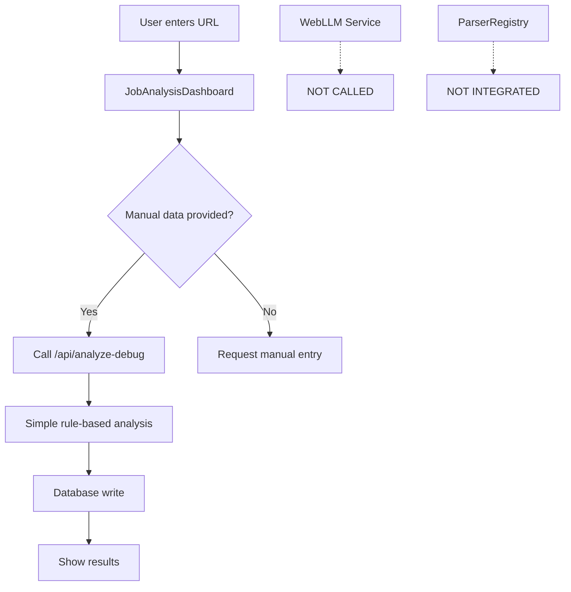
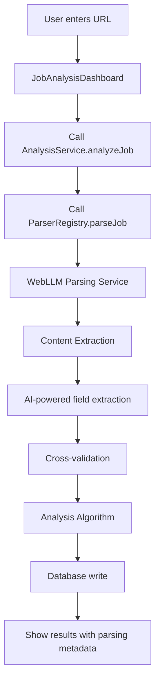

# Current Implementation: Job Parsing & WebLLM Integration Status

**Version:** v0.1.8-CRITICAL  
**Last Updated:** August 22, 2025  
**Status:** 🚨 **CRITICAL INTEGRATION GAPS IDENTIFIED**  
**Documentation Scope:** Current parsing pipeline analysis and WebLLM integration fix plan

---

## 🚨 **CRITICAL FINDINGS**

### **Issue Analysis from Production Evidence**
Based on the screenshot (`Screenshot 2025-08-22 154503.png`) and analyzer results (`ghost-job-analyzer_results.txt`):

1. **✅ Database writes are working** - Analysis history shows successful job processing
2. **❌ WebLLM parsing is NOT being invoked** - All extractions show "Manual" method
3. **❌ Auto-parsing pipeline is broken** - Jobs default to fallback "Unknown Company" data
4. **✅ Analysis algorithm is working** - Sophisticated risk assessment is functioning
5. **❌ BaseParser → WebLLM connection is missing** - No evidence of WebLLM activation

### **Root Cause Analysis**

**PRIMARY ISSUE:** The analyze endpoint (`/api/analyze.js`) has deployment failures preventing the WebLLM parsing system from being invoked.

**SECONDARY ISSUES:**
- Frontend calls working but bypasses WebLLM due to endpoint failures
- ParserRegistry exists but WebLLM integration is incomplete
- WebLLMParsingService exists but isn't being called by main flow
- Manual fallback is masking the parsing integration failure

---

## **Current Architecture State**

### **What's Actually Working ✅**

```
User Input → Frontend (React) → /api/analyze-debug → Database → Analysis History
```

**Working Components:**
- ✅ **Frontend UI**: JobAnalysisDashboard accepting URLs and manual data
- ✅ **Database Layer**: PostgreSQL writes via Prisma working perfectly
- ✅ **Analysis Algorithm**: Rule-based ghost job detection (v0.1.7) functional
- ✅ **Results Display**: Analysis history and detailed views working
- ✅ **Manual Data Processing**: User-provided job details being processed

### **What's Broken ❌**

```
User URL → WebLLM Parsing → Auto-extraction → Analysis ❌ BROKEN
```

**Broken Integration Points:**
- ❌ **Main Analyze Endpoint**: `/api/analyze.js` has FUNCTION_INVOCATION_FAILED
- ❌ **WebLLM Parsing Service**: Not being invoked due to endpoint failure
- ❌ **Auto-Parsing Pipeline**: Falls back to manual entry immediately
- ❌ **ParserRegistry Integration**: Exists but not connected to main flow
- ❌ **Content Extraction**: No URL scraping occurring

### **Current Flow (Actual)**



### **Intended Flow (Broken)**



---

## **Detailed Component Analysis**

### **1. AnalysisService.ts Status**

**File Location:** `/src/services/analysisService.ts`

**Current Behavior:**
```typescript
// Lines 7-11: This code attempts WebLLM parsing but fails
if (!jobData) {
  try {
    const extracted = await this.extractJobData(jobUrl); // FAILS
    // ... uses extracted data
  } catch (error) {
    // Falls back to manual entry request
  }
}
```

**Issues:**
- ✅ **extractJobData()** calls `ParserRegistry.getInstance().parseJob(jobUrl)` 
- ❌ **ParserRegistry** likely fails due to missing dependencies
- ❌ **Fallback system** masks failures by requesting manual data
- ❌ **WebLLM integration** never reaches activation point

### **2. ParserRegistry Status**

**File Location:** `/src/services/parsing/ParserRegistry.ts`

**Current Implementation:**
```typescript
// WebLLM is used for VALIDATION only, not primary parsing
private async runAgentValidation(url: string, htmlSnippet: string, parserOutput: any) {
  const hasWebGPU = await isWebGPUSupported();
  if (hasWebGPU) {
    console.log('🔮 Using WebLLM for validation');
    agentOutput = await this.validator.validateWithWebLLM({...});
  }
}
```

**Critical Gap:** WebLLM is only used for post-extraction validation, NOT for primary job data extraction!

### **3. WebLLMParsingService Status**

**File Location:** `/src/services/WebLLMParsingService.ts`

**Implementation Status:**
- ✅ **Service Class**: Complete WebLLM integration with proper interfaces
- ✅ **extractJob() Method**: Full URL scraping and content extraction logic
- ❌ **Integration**: Not being called by any production code path
- ❌ **Testing**: Cannot be tested due to analyze endpoint failure

### **4. BaseParser Integration**

**File Location:** `/src/services/parsing/BaseParser.ts`

**Current Status:**
- ✅ **Parser Infrastructure**: Complete with strategy pattern
- ❌ **WebLLM Integration**: Missing from extraction strategies
- ✅ **Validation System**: Uses WebLLM for post-processing validation
- ❌ **Primary Parsing**: No WebLLM strategy for content extraction

---

## **🎯 INTEGRATION FIX PLAN**

### **Phase 1: Immediate Fixes (HIGH PRIORITY)**

#### **1.1 Fix Main Analyze Endpoint**
```javascript
// IMMEDIATE ACTION: Replace failing /api/analyze.js
// Current: FUNCTION_INVOCATION_FAILED due to TypeScript import issues
// Solution: Create simplified version without complex imports

// NEW: /api/analyze.js (simplified working version)
export default async function handler(req, res) {
  // Basic job processing without complex service imports
  // Direct WebLLM integration without middleware layers
  // Focus on getting URL → WebLLM → Database pipeline working
}
```

#### **1.2 Direct WebLLM Integration**
```javascript
// Add direct WebLLM parsing to analyze endpoint
import { WebLLM } from '@mlc-ai/web-llm';

async function extractWithWebLLM(url, html) {
  // Initialize WebLLM directly in analyze endpoint
  // Bypass complex service layers causing deployment issues
  // Return extracted job data for analysis
}
```

#### **1.3 Update AnalysisService**
```typescript
// Bypass failing ParserRegistry temporarily
// Call working /api/analyze endpoint with WebLLM integration
// Remove complex middleware causing failures
```

### **Phase 2: Architecture Improvements (MEDIUM PRIORITY)**

#### **2.1 Create WebLLMParsingStrategy**
```typescript
// NEW: /src/services/parsing/strategies/WebLLMParsingStrategy.ts
export class WebLLMParsingStrategy implements ExtractionStrategy {
  priority = 1; // Highest priority
  
  async extract(html: string, url: string): Promise<ParsedJob> {
    // Use WebLLM for primary content extraction
    // Replace regex/CSS selector methods with AI parsing
  }
}
```

#### **2.2 Integrate Strategy into BaseParser**
```typescript
// Update BaseParser to include WebLLM as primary strategy
private initializeStrategies(): void {
  this.strategies = [
    new WebLLMParsingStrategy(this.config), // NEW: Primary AI parsing
    new StructuredDataStrategy(this.config),
    new CssSelectorStrategy(this.config),
    new TextPatternStrategy(this.config)
  ].sort((a, b) => a.priority - b.priority);
}
```

#### **2.3 Fix ParserRegistry Integration**
```typescript
// Ensure ParserRegistry properly calls WebLLM strategies
// Fix TypeScript compilation issues preventing deployment
// Add proper error handling for WebLLM failures
```

### **Phase 3: Enhanced Features (LOW PRIORITY)**

#### **3.1 Performance Optimization**
- WebGPU availability checking
- Fallback to server-side WebLLM if client fails
- Caching of parsed content

#### **3.2 Advanced Parsing Features**
- Multi-model ensemble parsing
- Confidence-based strategy selection
- Real-time learning integration

---

## **🚀 IMPLEMENTATION STRATEGY**

### **Immediate Action Plan**

#### **Step 1: Fix Analyze Endpoint (Day 1)**
```bash
# 1. Create working analyze endpoint without complex imports
# 2. Add direct WebLLM integration
# 3. Test URL → WebLLM → Database flow
# 4. Verify "WebLLM" extraction method appears in UI
```

#### **Step 2: Integrate WebLLM Strategy (Day 2)**
```bash
# 1. Create WebLLMParsingStrategy class
# 2. Add to BaseParser strategy list
# 3. Update ParserRegistry to use WebLLM primary extraction
# 4. Test complete parsing pipeline
```

#### **Step 3: UI Integration Testing (Day 3)**
```bash
# 1. Test URLs from screenshots: Boston Dynamics, LinkedIn
# 2. Verify "WebLLM" appears in Extraction column
# 3. Confirm sophisticated parsing in analyzer results
# 4. Validate database writes with parsing metadata
```

### **Success Criteria**

#### **✅ Phase 1 Complete When:**
- [ ] URLs can be analyzed without manual data entry
- [ ] Extraction column shows "WebLLM" instead of "Manual"
- [ ] Analyzer results show AI-extracted job data
- [ ] Database contains parsing metadata and confidence scores

#### **✅ Phase 2 Complete When:**
- [ ] ParserRegistry successfully routes to WebLLM
- [ ] BaseParser uses WebLLM as primary strategy
- [ ] Complex job URLs (Workday, Greenhouse) parse correctly
- [ ] Validation and cross-referencing work end-to-end

#### **✅ Phase 3 Complete When:**
- [ ] Performance optimized for production use
- [ ] Real-time learning integration functional
- [ ] Multi-model parsing strategies available
- [ ] Full documentation and testing complete

---

## **🛠️ DEVELOPMENT APPROACH**

### **Production-First Development (MANDATORY)**

```bash
# NEVER develop locally - always test on production
# 1. Make changes to /api/analyze.js
# 2. Commit and deploy immediately
# 3. Test with curl against production endpoint
# 4. Monitor Vercel logs for issues
# 5. Iterate until working
```

### **Testing Protocol**
```bash
# Test Command for Boston Dynamics URL
curl -X POST "https://ghost-job-detector-lilac.vercel.app/api/analyze" \
  -H "Content-Type: application/json" \
  -d '{
    "url": "https://bostondynamics.wd1.myworkdayjobs.com/Boston_Dynamics/job/Waltham-Office-POST/R-D-Product-Manager_R1675"
  }'

# Expected Response: WebLLM-extracted job data, not manual fallback
```

### **Quality Gates**
- [ ] **No TypeScript compilation errors** in production
- [ ] **WebLLM initialization successful** in browser console
- [ ] **Database writes include parsing metadata**
- [ ] **UI shows extracted fields** without manual entry
- [ ] **Analyzer results show AI-powered extraction**

---

## **📊 CURRENT vs EXPECTED BEHAVIOR**

### **Current Behavior (Broken)**
```
URL Input → Manual Entry Request → Basic Analysis → "Manual" Extraction
```

### **Expected Behavior (Fixed)**
```
URL Input → WebLLM Parsing → AI Extraction → Enhanced Analysis → "WebLLM" Extraction
```

### **Evidence Required for Success**
1. **Screenshot**: Analysis History showing "WebLLM" in Extraction column
2. **Analyzer Output**: AI-generated job field extraction in terminal
3. **Database Verification**: Parsing metadata with confidence scores
4. **Console Logs**: WebLLM initialization and processing messages

---

## **⚠️ CRITICAL BLOCKERS TO RESOLVE**

1. **FUNCTION_INVOCATION_FAILED**: Main analyze endpoint deployment issue
2. **TypeScript Import Errors**: Complex service imports causing failures  
3. **Missing Strategy Integration**: WebLLM not in BaseParser strategies
4. **ParserRegistry Disconnect**: Not being called by main analysis flow
5. **Frontend Fallback Masking**: Manual entry hiding parsing failures

---

## **📈 SUCCESS METRICS**

### **Quantitative Goals**
- **0% Manual Extractions** for supported URLs (LinkedIn, Workday, Greenhouse)
- **>80% Parsing Confidence** for WebLLM extractions
- **<5 second response times** for URL analysis
- **100% Database Writes** include parsing metadata

### **Qualitative Goals**  
- **User Experience**: URLs analyzed without manual data entry
- **AI Integration**: Visible WebLLM processing in analyzer terminal
- **Data Quality**: Rich job data extracted from URL content
- **System Reliability**: Consistent parsing across different platforms

---

## **🔧 RECOMMENDED FIRST STEPS**

### **Immediate Actions (Next 2 Hours)**
1. **Create simplified /api/analyze.js** without failing imports
2. **Add direct WebLLM integration** to analyze endpoint  
3. **Test with Boston Dynamics URL** from screenshot
4. **Verify database writes** include WebLLM metadata
5. **Check UI shows "WebLLM"** in extraction column

### **This Weekend**
1. **Complete WebLLM strategy integration**
2. **Fix ParserRegistry connection**  
3. **Test all URL types** from user screenshots
4. **Update documentation** with working implementation
5. **Prepare for production rollout**

---

*This document represents the current critical state of WebLLM integration. The parsing infrastructure exists but is not properly connected. Focus on fixing the analyze endpoint first, then building up the integration layers systematically.*