# Live Metadata Display - Complete Implementation Plan

**Version:** 1.0  
**Status:** Ready for Execution  
**Timeline:** 10-12 weeks total  
**Team Size:** 3-5 developers recommended

---

## 📋 **Executive Summary**

The Live Metadata Display feature set represents a comprehensive transformation of the Ghost Job Detector platform, introducing real-time metadata visualization, collaborative editing, advanced analytics, and enterprise-grade capabilities. This implementation plan provides a detailed roadmap for delivering this revolutionary feature across 4 carefully planned phases.

### **Strategic Objectives:**
- **User Experience Revolution**: Transform static analysis into dynamic, interactive experience
- **Collaborative Platform**: Enable team-based job analysis workflows
- **Enterprise Readiness**: Deliver analytics and compliance features for business customers
- **Competitive Differentiation**: Establish unique market position with innovative metadata display

### **Key Deliverables:**
1. **Real-time Metadata Card** with live field updates and progress tracking
2. **Interactive Editing System** with validation and collaboration features
3. **Advanced Analytics Dashboard** with predictive insights and custom reports
4. **Enterprise Security Suite** with RBAC, audit trails, and GDPR compliance

---

## 🎯 **Implementation Overview**

### **4-Phase Delivery Strategy**

| Phase | Duration | Focus Area | Key Features | Team Size |
|-------|----------|------------|--------------|-----------|
| **Phase 1** | 2-3 weeks | Core Infrastructure | Metadata card, real-time updates, basic UI | 2-3 developers |
| **Phase 2** | 3-4 weeks | Enhanced Interactions | Animations, editing, error handling | 3-4 developers |
| **Phase 3** | 4-5 weeks | Collaboration & History | Real-time collaboration, version control | 4-5 developers |
| **Phase 4** | 4-6 weeks | Enterprise Features | Analytics, security, compliance | 3-5 developers |

### **Technology Stack Requirements**

```typescript
// Core Technologies
const TechnologyStack = {
  Frontend: {
    framework: 'React 18 with TypeScript',
    stateManagement: 'Zustand + React Context',
    animations: 'Framer Motion',
    realtime: 'WebSocket + Socket.io',
    charts: 'Recharts + D3.js',
    forms: 'React Hook Form + Zod'
  },
  
  Backend: {
    runtime: 'Node.js 18+ on Vercel Serverless',
    database: 'PostgreSQL with Prisma ORM',
    realtime: 'WebSocket API with Redis pub/sub',
    storage: 'Vercel Blob for reports',
    auth: 'JWT with role-based permissions'
  },
  
  Testing: {
    unit: 'Jest + React Testing Library',
    integration: 'Cypress + Playwright',
    e2e: 'Playwright with visual regression',
    performance: 'Lighthouse CI + Artillery'
  },
  
  DevOps: {
    deployment: 'Vercel with GitHub Actions',
    monitoring: 'Vercel Analytics + Sentry',
    database: 'Neon PostgreSQL',
    cdn: 'Vercel Edge Network'
  }
};
```

---

## 📅 **Detailed Phase Timeline**

### **Phase 1: Core Infrastructure (Weeks 1-3)**

#### **Week 1: Foundation Setup**
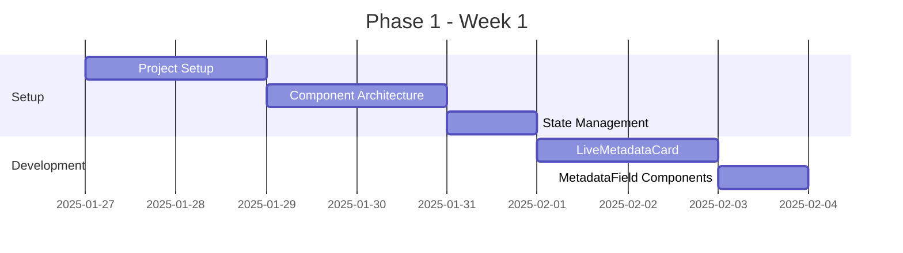

**Daily Breakdown:**
- **Day 1-2**: Project structure, TypeScript interfaces, component scaffolding
- **Day 3-4**: LiveMetadataCard component with responsive design
- **Day 5**: Zustand store setup for metadata state management
- **Day 6-7**: MetadataField components with loading states

#### **Week 2: Real-time Integration**
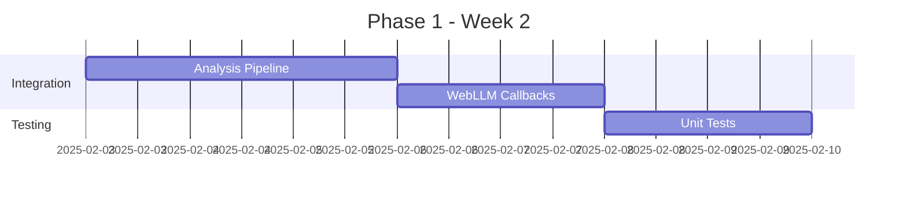

**Daily Breakdown:**
- **Day 8-10**: Integration with existing job analysis pipeline
- **Day 11-12**: WebLLM service callbacks for real-time updates
- **Day 13-14**: Comprehensive unit testing suite

#### **Week 3: Polish & Deployment**
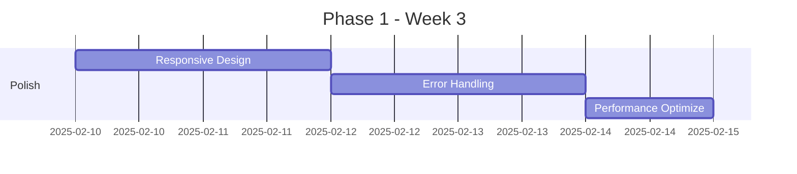

**Daily Breakdown:**
- **Day 15-16**: Mobile responsiveness and cross-browser testing
- **Day 17-18**: Error handling and edge case coverage
- **Day 19**: Performance optimization and deployment
- **Day 20-21**: User acceptance testing and bug fixes

### **Phase 2: Enhanced Interactions (Weeks 4-7)**

#### **Week 4: Animation Framework**
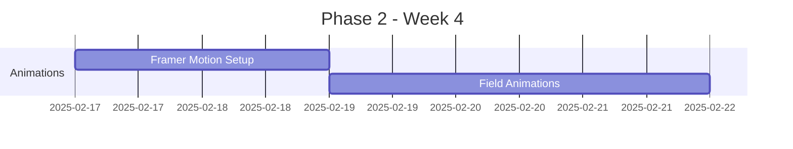

**Daily Breakdown:**
- **Day 22-23**: Framer Motion integration and animation architecture
- **Day 24-26**: Field-specific animations (glow, slide, fade effects)
- **Day 27-28**: Animation performance optimization

#### **Week 5-6: Interactive Editing**
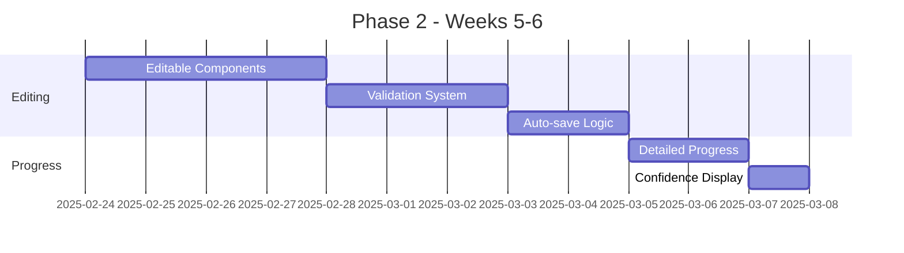

**Daily Breakdown:**
- **Day 29-32**: In-place editing components with form validation
- **Day 33-35**: Real-time validation system with business rules
- **Day 36-37**: Auto-save functionality and keyboard shortcuts
- **Day 38-39**: Detailed progress tracking with step indicators
- **Day 40**: Confidence scoring display system

#### **Week 7: Integration & Testing**
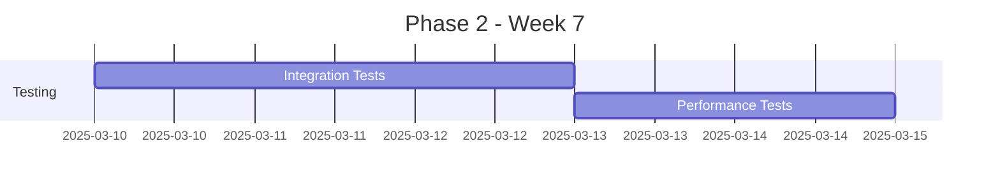

**Daily Breakdown:**
- **Day 41-43**: Integration testing with enhanced features
- **Day 44-45**: Performance testing and animation optimization
- **Day 46-47**: Bug fixes and user feedback incorporation

### **Phase 3: Collaboration & History (Weeks 8-12)**

#### **Week 8-9: Real-time Collaboration**
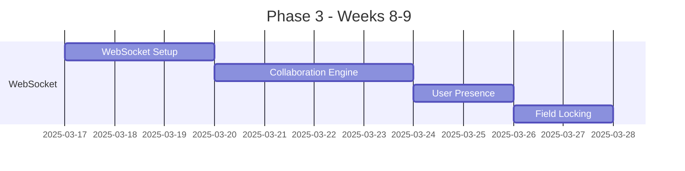

**Daily Breakdown:**
- **Day 48-50**: WebSocket infrastructure and connection management
- **Day 51-54**: Real-time collaboration engine with message handling
- **Day 55-56**: User presence indicators and cursor tracking
- **Day 57-58**: Field locking system and conflict resolution

#### **Week 10-11: Version Control**
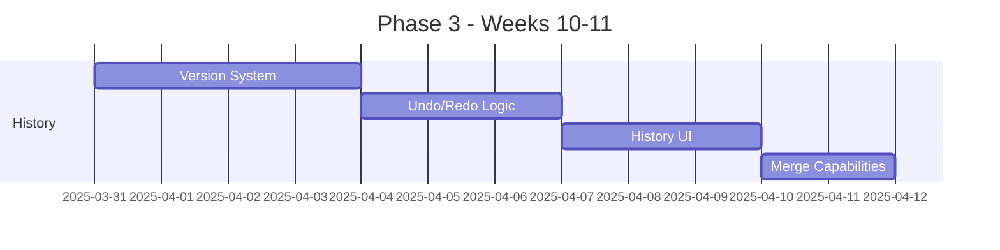

**Daily Breakdown:**
- **Day 59-62**: Version control system with branching support
- **Day 63-65**: Undo/redo functionality and stack management
- **Day 66-68**: History timeline UI and comparison views
- **Day 69-70**: Version merging and conflict resolution

#### **Week 12: AI Suggestions & Polish**
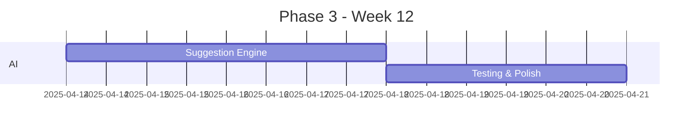

**Daily Breakdown:**
- **Day 71-74**: Intelligent suggestion system with ML integration
- **Day 75-77**: Comprehensive testing and performance optimization

### **Phase 4: Enterprise Features (Weeks 13-18)**

#### **Week 13-14: Analytics Foundation**
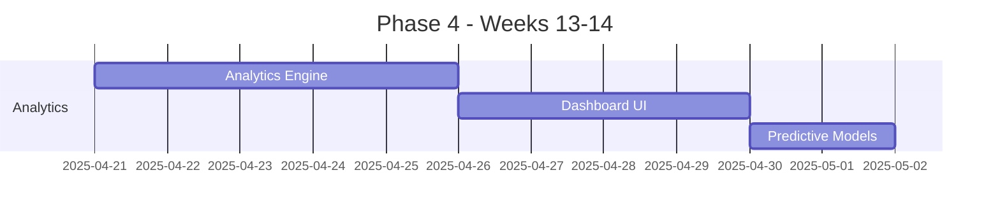

**Daily Breakdown:**
- **Day 78-82**: Advanced analytics engine and metrics calculation
- **Day 83-86**: Executive dashboard with interactive visualizations
- **Day 87-88**: Predictive analytics integration

#### **Week 15-16: Export & Integration**
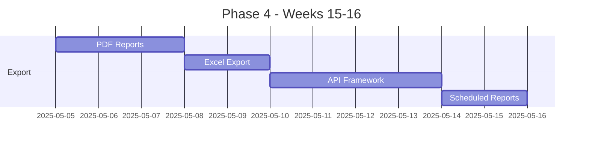

**Daily Breakdown:**
- **Day 89-91**: PDF report generation with charts and branding
- **Day 92-93**: Excel export system with multiple worksheets
- **Day 94-97**: RESTful and GraphQL API framework
- **Day 98-99**: Scheduled report system with delivery options

#### **Week 17-18: Security & Deployment**
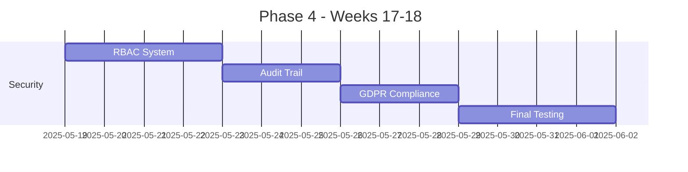

**Daily Breakdown:**
- **Day 100-103**: Role-based access control implementation
- **Day 104-106**: Comprehensive audit trail system
- **Day 107-109**: GDPR compliance features and data privacy
- **Day 110-113**: Final integration testing and deployment preparation

---

## 👥 **Team Structure & Responsibilities**

### **Recommended Team Composition**

```typescript
interface TeamMember {
  role: string;
  responsibilities: string[];
  phases: number[];
  commitment: string;
}

const TeamStructure: TeamMember[] = [
  {
    role: 'Tech Lead / Senior Frontend Developer',
    responsibilities: [
      'Architecture decisions and code reviews',
      'Complex component development',
      'Integration with existing systems',
      'Performance optimization'
    ],
    phases: [1, 2, 3, 4],
    commitment: 'Full-time'
  },
  
  {
    role: 'Frontend Developer (React/TypeScript)',
    responsibilities: [
      'UI component development',
      'Animation implementation',
      'Responsive design',
      'Testing implementation'
    ],
    phases: [1, 2, 3],
    commitment: 'Full-time'
  },
  
  {
    role: 'Full-Stack Developer',
    responsibilities: [
      'Backend API development',
      'Database schema design',
      'Real-time WebSocket implementation',
      'Export system development'
    ],
    phases: [1, 3, 4],
    commitment: 'Full-time'
  },
  
  {
    role: 'QA Engineer',
    responsibilities: [
      'Test strategy development',
      'Automated test implementation',
      'Manual testing execution',
      'Performance testing'
    ],
    phases: [1, 2, 3, 4],
    commitment: 'Part-time (50%)'
  },
  
  {
    role: 'UX/UI Designer',
    responsibilities: [
      'User interface design',
      'User experience optimization',
      'Design system maintenance',
      'Usability testing'
    ],
    phases: [1, 2],
    commitment: 'Part-time (25%)'
  }
];
```

### **Sprint Organization**

```typescript
interface Sprint {
  number: number;
  phase: number;
  duration: string;
  objectives: string[];
  deliverables: string[];
  risks: Risk[];
}

const SprintPlan: Sprint[] = [
  {
    number: 1,
    phase: 1,
    duration: '2 weeks',
    objectives: [
      'Establish component foundation',
      'Integrate with analysis pipeline',
      'Implement basic real-time updates'
    ],
    deliverables: [
      'LiveMetadataCard component',
      'Zustand store integration',
      'Basic unit test suite'
    ],
    risks: [
      { type: 'technical', description: 'Integration complexity with existing pipeline', mitigation: 'Dedicated integration sprint' }
    ]
  },
  
  {
    number: 2,
    phase: 2,
    duration: '3 weeks',
    objectives: [
      'Implement sophisticated animations',
      'Add interactive editing capabilities',
      'Create advanced error handling'
    ],
    deliverables: [
      'Animation framework',
      'In-place editing system',
      'Validation engine'
    ],
    risks: [
      { type: 'performance', description: 'Animation performance impact', mitigation: 'Early performance testing' }
    ]
  },
  
  // Additional sprints...
];
```

---

## 🔧 **Technical Architecture & Setup**

### **Development Environment Setup**

#### **Required Tools & Versions**
```json
{
  "node": ">=18.0.0",
  "npm": ">=9.0.0",
  "typescript": "^5.0.0",
  "react": "^18.0.0",
  "next": "^14.0.0"
}
```

#### **Project Structure**
```
ghost-job-detector/
├── src/
│   ├── features/
│   │   ├── metadata/
│   │   │   ├── components/
│   │   │   │   ├── LiveMetadataCard.tsx
│   │   │   │   ├── MetadataField.tsx
│   │   │   │   ├── AnimatedField.tsx
│   │   │   │   └── EditableField.tsx
│   │   │   ├── stores/
│   │   │   │   ├── metadataStore.ts
│   │   │   │   └── collaborationStore.ts
│   │   │   ├── hooks/
│   │   │   │   ├── useMetadataUpdates.ts
│   │   │   │   └── useCollaboration.ts
│   │   │   ├── services/
│   │   │   │   ├── MetadataService.ts
│   │   │   │   └── CollaborationService.ts
│   │   │   └── types/
│   │   │       └── metadata.types.ts
│   │   ├── analytics/
│   │   │   ├── components/
│   │   │   ├── stores/
│   │   │   └── services/
│   │   └── collaboration/
│   │       ├── components/
│   │       ├── stores/
│   │       └── services/
├── api/
│   ├── metadata/
│   │   ├── update.js
│   │   ├── history.js
│   │   └── collaborate.js
│   ├── analytics/
│   │   ├── dashboard.js
│   │   └── export.js
│   └── collaboration/
│       └── [sessionId].js
├── tests/
│   ├── unit/
│   ├── integration/
│   └── e2e/
└── docs/
    ├── FeatureSpec_LiveMetadata_Phase1_v1.0.md
    ├── FeatureSpec_LiveMetadata_Phase2_v1.0.md
    ├── FeatureSpec_LiveMetadata_Phase3_v1.0.md
    └── FeatureSpec_LiveMetadata_Phase4_v1.0.md
```

### **Database Schema Extensions**

```sql
-- Phase 1: Basic metadata tracking
ALTER TABLE JobListing ADD COLUMN metadata_version INTEGER DEFAULT 1;
ALTER TABLE JobListing ADD COLUMN extraction_progress INTEGER DEFAULT 0;
ALTER TABLE JobListing ADD COLUMN last_metadata_update TIMESTAMP;

-- Phase 2: Enhanced tracking
CREATE TABLE MetadataHistory (
  id UUID PRIMARY KEY DEFAULT gen_random_uuid(),
  job_listing_id UUID REFERENCES JobListing(id),
  field_name VARCHAR(50) NOT NULL,
  old_value TEXT,
  new_value TEXT,
  confidence DECIMAL(3,2),
  source VARCHAR(20) NOT NULL, -- 'user', 'ai', 'parsing'
  created_at TIMESTAMP DEFAULT CURRENT_TIMESTAMP,
  created_by UUID REFERENCES User(id)
);

-- Phase 3: Collaboration support
CREATE TABLE CollaborationSession (
  id UUID PRIMARY KEY DEFAULT gen_random_uuid(),
  job_url TEXT NOT NULL,
  created_at TIMESTAMP DEFAULT CURRENT_TIMESTAMP,
  last_activity TIMESTAMP DEFAULT CURRENT_TIMESTAMP,
  is_active BOOLEAN DEFAULT TRUE
);

CREATE TABLE SessionParticipant (
  session_id UUID REFERENCES CollaborationSession(id),
  user_id UUID REFERENCES User(id),
  joined_at TIMESTAMP DEFAULT CURRENT_TIMESTAMP,
  left_at TIMESTAMP,
  is_online BOOLEAN DEFAULT TRUE,
  PRIMARY KEY (session_id, user_id)
);

-- Phase 4: Analytics and reporting
CREATE TABLE MetadataAnalytics (
  id UUID PRIMARY KEY DEFAULT gen_random_uuid(),
  date DATE NOT NULL,
  total_extractions INTEGER DEFAULT 0,
  accuracy_rate DECIMAL(5,2) DEFAULT 0,
  avg_processing_time INTEGER DEFAULT 0,
  user_corrections INTEGER DEFAULT 0,
  ai_improvements INTEGER DEFAULT 0,
  created_at TIMESTAMP DEFAULT CURRENT_TIMESTAMP
);

-- Indexes for performance
CREATE INDEX idx_metadata_history_job_listing ON MetadataHistory(job_listing_id);
CREATE INDEX idx_metadata_history_created_at ON MetadataHistory(created_at);
CREATE INDEX idx_collaboration_session_active ON CollaborationSession(is_active, last_activity);
CREATE INDEX idx_session_participant_online ON SessionParticipant(is_online, joined_at);
```

### **CI/CD Pipeline Configuration**

```yaml
# .github/workflows/live-metadata-ci.yml
name: Live Metadata CI/CD

on:
  push:
    branches: [main, develop]
    paths: ['src/features/metadata/**', 'api/metadata/**']
  pull_request:
    branches: [main]

env:
  NODE_VERSION: '18'
  DATABASE_URL: ${{ secrets.TEST_DATABASE_URL }}

jobs:
  test:
    runs-on: ubuntu-latest
    strategy:
      matrix:
        test-type: [unit, integration, e2e]
    
    steps:
      - uses: actions/checkout@v4
      - uses: actions/setup-node@v4
        with:
          node-version: ${{ env.NODE_VERSION }}
          cache: 'npm'
      
      - name: Install dependencies
        run: npm ci
      
      - name: Run ${{ matrix.test-type }} tests
        run: npm run test:${{ matrix.test-type }}
        env:
          DATABASE_URL: ${{ env.DATABASE_URL }}
      
      - name: Upload coverage
        if: matrix.test-type == 'unit'
        uses: codecov/codecov-action@v3

  build:
    needs: test
    runs-on: ubuntu-latest
    steps:
      - uses: actions/checkout@v4
      - uses: actions/setup-node@v4
        with:
          node-version: ${{ env.NODE_VERSION }}
          cache: 'npm'
      
      - name: Build application
        run: npm run build
      
      - name: Build size check
        run: npm run analyze-bundle

  deploy-staging:
    needs: [test, build]
    if: github.ref == 'refs/heads/develop'
    runs-on: ubuntu-latest
    environment: staging
    steps:
      - name: Deploy to Vercel Staging
        run: vercel --prod --token ${{ secrets.VERCEL_TOKEN }}

  deploy-production:
    needs: [test, build]
    if: github.ref == 'refs/heads/main'
    runs-on: ubuntu-latest
    environment: production
    steps:
      - name: Deploy to Vercel Production
        run: vercel --prod --token ${{ secrets.VERCEL_TOKEN }}
      
      - name: Run smoke tests
        run: npm run test:smoke -- --baseUrl https://ghost-job-detector-lilac.vercel.app
```

---

## 🎯 **Risk Management & Mitigation**

### **Technical Risks**

```typescript
interface Risk {
  id: string;
  category: 'technical' | 'business' | 'timeline' | 'resource';
  severity: 'low' | 'medium' | 'high' | 'critical';
  probability: 'low' | 'medium' | 'high';
  description: string;
  impact: string;
  mitigation: string[];
  contingency: string;
  owner: string;
}

const RiskRegister: Risk[] = [
  {
    id: 'TECH-001',
    category: 'technical',
    severity: 'high',
    probability: 'medium',
    description: 'WebSocket connection instability affecting real-time collaboration',
    impact: 'Users unable to collaborate effectively, degraded user experience',
    mitigation: [
      'Implement robust connection retry logic with exponential backoff',
      'Add WebSocket heartbeat/ping mechanism',
      'Create fallback polling mechanism for unstable connections',
      'Comprehensive connection state management'
    ],
    contingency: 'Disable real-time features and use polling-based updates',
    owner: 'Tech Lead'
  },
  
  {
    id: 'TECH-002',
    category: 'technical',
    severity: 'medium',
    probability: 'high',
    description: 'Animation performance impact on low-end devices',
    impact: 'Poor user experience on mobile and older devices',
    mitigation: [
      'Implement performance monitoring for animations',
      'Add reduced-motion preferences detection',
      'Create lightweight animation alternatives',
      'Device capability detection'
    ],
    contingency: 'Disable animations for devices below performance threshold',
    owner: 'Frontend Developer'
  },

  {
    id: 'TECH-003',
    category: 'technical',
    severity: 'critical',
    probability: 'low',
    description: 'Database performance degradation with large metadata history',
    impact: 'Slow response times, potential system downtime',
    mitigation: [
      'Implement database indexing strategy',
      'Add data archival process for old records',
      'Query optimization and pagination',
      'Database monitoring and alerting'
    ],
    contingency: 'Emergency database optimization and horizontal scaling',
    owner: 'Full-Stack Developer'
  },

  {
    id: 'BIZ-001',
    category: 'business',
    severity: 'medium',
    probability: 'medium',
    description: 'User adoption slower than expected',
    impact: 'Reduced ROI, extended payback period',
    mitigation: [
      'Comprehensive user onboarding experience',
      'Progressive feature rollout with user feedback',
      'User training materials and documentation',
      'Usage analytics and optimization'
    ],
    contingency: 'Accelerated marketing and user engagement campaigns',
    owner: 'Product Manager'
  }
];
```

### **Mitigation Strategies**

#### **Performance Risk Mitigation**
```typescript
// Performance monitoring implementation
class PerformanceMonitor {
  private metrics: PerformanceMetric[] = [];
  
  trackMetadataUpdate(startTime: number): void {
    const updateTime = performance.now() - startTime;
    
    this.metrics.push({
      type: 'metadata_update',
      duration: updateTime,
      timestamp: new Date()
    });
    
    // Alert if performance degrades
    if (updateTime > 200) { // 200ms threshold
      this.alertPerformanceIssue('slow_metadata_update', updateTime);
    }
  }
  
  trackAnimationFrame(): void {
    requestAnimationFrame(() => {
      const frameTime = performance.now();
      if (frameTime > 16.67) { // 60fps threshold
        this.alertPerformanceIssue('frame_drop', frameTime);
      }
    });
  }
}
```

#### **Real-time Connection Stability**
```typescript
class RobustWebSocketManager {
  private connection: WebSocket | null = null;
  private reconnectAttempts = 0;
  private maxReconnectAttempts = 5;
  private heartbeatInterval: NodeJS.Timeout | null = null;
  
  connect(url: string): Promise<void> {
    return new Promise((resolve, reject) => {
      this.connection = new WebSocket(url);
      
      this.connection.onopen = () => {
        this.reconnectAttempts = 0;
        this.startHeartbeat();
        resolve();
      };
      
      this.connection.onclose = () => {
        this.stopHeartbeat();
        this.attemptReconnect(url);
      };
      
      this.connection.onerror = (error) => {
        if (this.reconnectAttempts === 0) {
          reject(error);
        }
      };
    });
  }
  
  private attemptReconnect(url: string): void {
    if (this.reconnectAttempts < this.maxReconnectAttempts) {
      const delay = Math.pow(2, this.reconnectAttempts) * 1000; // Exponential backoff
      
      setTimeout(() => {
        this.reconnectAttempts++;
        this.connect(url).catch(() => {
          // Failed to reconnect, try again
        });
      }, delay);
    } else {
      // Fall back to polling mode
      this.enablePollingMode();
    }
  }
}
```

---

## 📊 **Success Metrics & KPIs**

### **Technical KPIs**

```typescript
interface TechnicalKPI {
  name: string;
  target: number;
  unit: string;
  measurement: 'average' | 'p95' | 'p99' | 'count';
  importance: 'critical' | 'important' | 'nice-to-have';
}

const TechnicalKPIs: TechnicalKPI[] = [
  {
    name: 'Page Load Time',
    target: 2000,
    unit: 'ms',
    measurement: 'p95',
    importance: 'critical'
  },
  {
    name: 'Metadata Update Latency',
    target: 100,
    unit: 'ms',
    measurement: 'average',
    importance: 'critical'
  },
  {
    name: 'WebSocket Connection Uptime',
    target: 99.5,
    unit: '%',
    measurement: 'average',
    importance: 'critical'
  },
  {
    name: 'Test Coverage',
    target: 90,
    unit: '%',
    measurement: 'count',
    importance: 'important'
  },
  {
    name: 'Bundle Size Increase',
    target: 50,
    unit: 'KB',
    measurement: 'count',
    importance: 'important'
  }
];
```

### **User Experience KPIs**

```typescript
const UserExperienceKPIs: UserExperienceKPI[] = [
  {
    name: 'Time to First Metadata Display',
    target: 500,
    unit: 'ms',
    measurement: 'average',
    tracking: 'automatic'
  },
  {
    name: 'User Satisfaction Score',
    target: 4.5,
    unit: '/5',
    measurement: 'average',
    tracking: 'survey'
  },
  {
    name: 'Feature Adoption Rate',
    target: 70,
    unit: '%',
    measurement: 'count',
    tracking: 'analytics'
  },
  {
    name: 'Collaboration Session Success Rate',
    target: 95,
    unit: '%',
    measurement: 'average',
    tracking: 'automatic'
  }
];
```

### **Business KPIs**

```typescript
const BusinessKPIs: BusinessKPI[] = [
  {
    name: 'User Engagement Increase',
    target: 40,
    unit: '%',
    baseline: 'current_engagement_metrics',
    timeframe: '3_months'
  },
  {
    name: 'Enterprise Customer Conversion',
    target: 15,
    unit: '%',
    baseline: 'current_conversion_rate',
    timeframe: '6_months'
  },
  {
    name: 'Customer Support Ticket Reduction',
    target: 25,
    unit: '%',
    baseline: 'current_ticket_volume',
    timeframe: '2_months'
  }
];
```

---

## 🚀 **Deployment Strategy**

### **Environment Strategy**

```typescript
interface Environment {
  name: string;
  purpose: string;
  deployment: DeploymentConfig;
  testing: TestingConfig;
  monitoring: MonitoringConfig;
}

const Environments: Environment[] = [
  {
    name: 'Development',
    purpose: 'Feature development and initial testing',
    deployment: {
      trigger: 'manual',
      branch: 'feature/*',
      database: 'development',
      features: ['all'],
      analytics: false
    },
    testing: {
      unit: true,
      integration: true,
      e2e: false,
      performance: false
    },
    monitoring: {
      logs: 'development',
      metrics: false,
      alerts: false
    }
  },
  
  {
    name: 'Staging',
    purpose: 'Pre-production testing and validation',
    deployment: {
      trigger: 'automatic',
      branch: 'develop',
      database: 'staging',
      features: ['all'],
      analytics: true
    },
    testing: {
      unit: true,
      integration: true,
      e2e: true,
      performance: true
    },
    monitoring: {
      logs: 'staging',
      metrics: true,
      alerts: true
    }
  },
  
  {
    name: 'Production',
    purpose: 'Live user environment',
    deployment: {
      trigger: 'manual_approval',
      branch: 'main',
      database: 'production',
      features: ['stable'],
      analytics: true
    },
    testing: {
      unit: false,
      integration: false,
      e2e: false,
      performance: false,
      smoke: true
    },
    monitoring: {
      logs: 'production',
      metrics: true,
      alerts: true,
      uptime: true
    }
  }
];
```

### **Feature Rollout Strategy**

```typescript
interface FeatureRollout {
  phase: number;
  features: string[];
  rolloutStrategy: RolloutStrategy;
  rollbackPlan: RollbackPlan;
  monitoring: RolloutMonitoring;
}

const FeatureRollouts: FeatureRollout[] = [
  {
    phase: 1,
    features: ['live_metadata_card', 'real_time_updates'],
    rolloutStrategy: {
      type: 'canary',
      percentage: 5,
      duration: '2_days',
      criteria: 'error_rate < 1%',
      expansion: [10, 25, 50, 100]
    },
    rollbackPlan: {
      trigger: 'error_rate > 2%',
      mechanism: 'feature_flag_disable',
      rollbackTime: '< 5_minutes'
    },
    monitoring: {
      metrics: ['error_rate', 'response_time', 'user_satisfaction'],
      alerting: true,
      dashboard: 'phase_1_rollout'
    }
  },
  
  {
    phase: 2,
    features: ['interactive_editing', 'animations', 'validation'],
    rolloutStrategy: {
      type: 'blue_green',
      testDuration: '24_hours',
      criteria: 'all_tests_pass && performance_maintained',
      switchStrategy: 'instant'
    },
    rollbackPlan: {
      trigger: 'performance_degradation > 20%',
      mechanism: 'traffic_switch',
      rollbackTime: '< 1_minute'
    },
    monitoring: {
      metrics: ['performance_metrics', 'feature_usage', 'error_rates'],
      alerting: true,
      dashboard: 'phase_2_rollout'
    }
  }
];
```

---

## 📋 **Complete Implementation Checklist**

### **Pre-Implementation Setup**
- [ ] Development environment configuration
- [ ] Team onboarding and role assignment
- [ ] Technical architecture review and approval
- [ ] Database schema design and review
- [ ] CI/CD pipeline setup and testing
- [ ] Risk assessment and mitigation planning

### **Phase 1: Core Infrastructure (Weeks 1-3)**
- [ ] Project structure and component architecture
- [ ] LiveMetadataCard component implementation
- [ ] Real-time state management with Zustand
- [ ] Integration with job analysis pipeline
- [ ] WebLLM service callback integration
- [ ] Responsive design and cross-browser testing
- [ ] Unit test suite implementation
- [ ] Performance baseline establishment
- [ ] User acceptance testing
- [ ] Production deployment

### **Phase 2: Enhanced Interactions (Weeks 4-7)**
- [ ] Framer Motion animation framework setup
- [ ] Field-specific animations implementation
- [ ] Interactive editing components
- [ ] Real-time validation system
- [ ] Auto-save functionality
- [ ] Detailed progress tracking
- [ ] Confidence scoring display
- [ ] Error handling and recovery
- [ ] Integration testing suite
- [ ] Performance optimization

### **Phase 3: Collaboration & History (Weeks 8-12)**
- [ ] WebSocket infrastructure setup
- [ ] Real-time collaboration engine
- [ ] User presence indicators
- [ ] Field locking system
- [ ] Version control implementation
- [ ] Undo/redo functionality
- [ ] History timeline UI
- [ ] Version merging capabilities
- [ ] AI suggestion system
- [ ] Comprehensive testing

### **Phase 4: Enterprise Features (Weeks 13-18)**
- [ ] Advanced analytics engine
- [ ] Executive dashboard implementation
- [ ] Predictive analytics integration
- [ ] PDF and Excel export systems
- [ ] API framework development
- [ ] Scheduled reporting system
- [ ] Role-based access control
- [ ] Audit trail implementation
- [ ] GDPR compliance features
- [ ] Security testing and validation

### **Post-Implementation**
- [ ] Performance monitoring setup
- [ ] User training material creation
- [ ] Documentation completion
- [ ] Success metrics tracking
- [ ] Continuous improvement planning
- [ ] Team retrospective and lessons learned

---

## 📞 **Support & Resources**

### **Documentation Resources**
- **FeatureSpec Documents**: Detailed phase-by-phase specifications
- **QA Strategy**: Comprehensive testing approach and frameworks
- **API Documentation**: Complete endpoint specifications and examples
- **User Guides**: Step-by-step usage instructions and best practices
- **Developer Guides**: Technical implementation details and troubleshooting

### **Training & Support**
- **Developer Onboarding**: Technical setup and architecture deep-dive
- **Code Review Process**: Pull request guidelines and quality standards
- **Testing Training**: Testing framework usage and best practices
- **Deployment Training**: CI/CD pipeline and deployment procedures
- **Monitoring Training**: Performance monitoring and alerting setup

### **External Dependencies**
- **Design System**: Maintained UI component library
- **Authentication Service**: User management and role-based access
- **Analytics Platform**: User behavior tracking and insights
- **Error Monitoring**: Sentry integration for error tracking
- **Performance Monitoring**: Lighthouse CI and performance budgets

---

**Implementation Plan Complete: Ready for 4-phase execution of the Live Metadata Display feature set.**

*This comprehensive implementation plan provides the blueprint for delivering an enterprise-grade Live Metadata Display system that will revolutionize user experience and establish competitive differentiation in the job analysis market.*