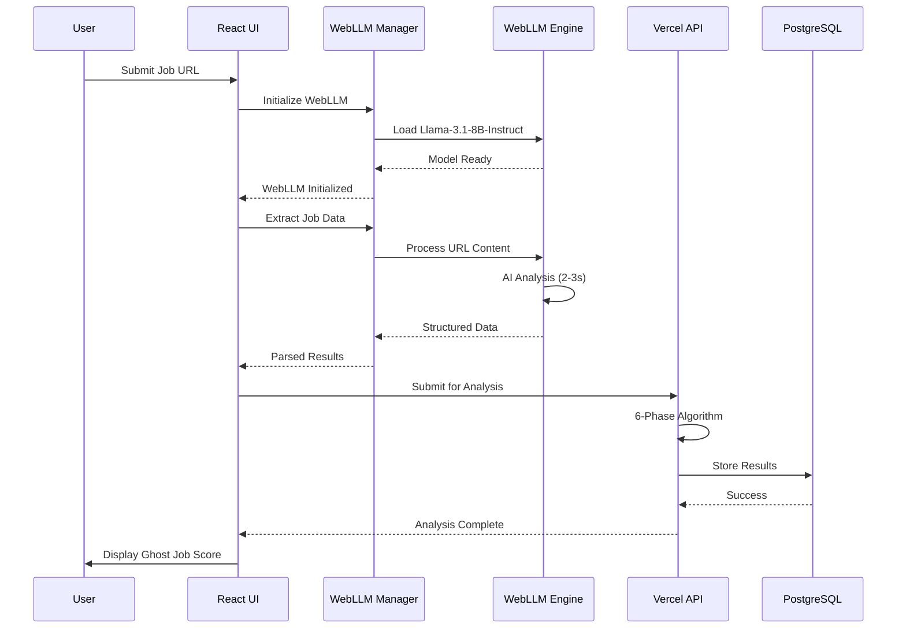
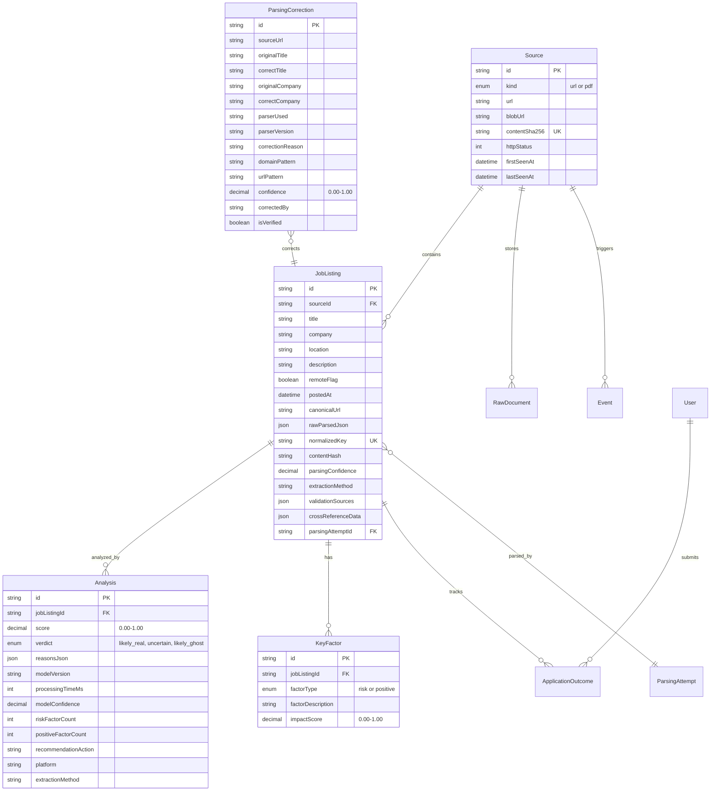
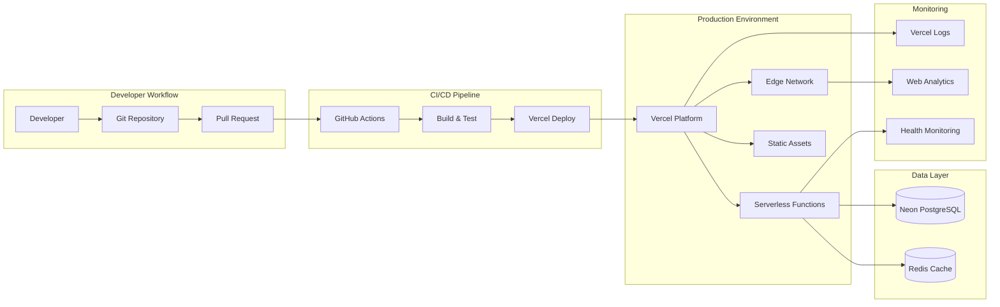
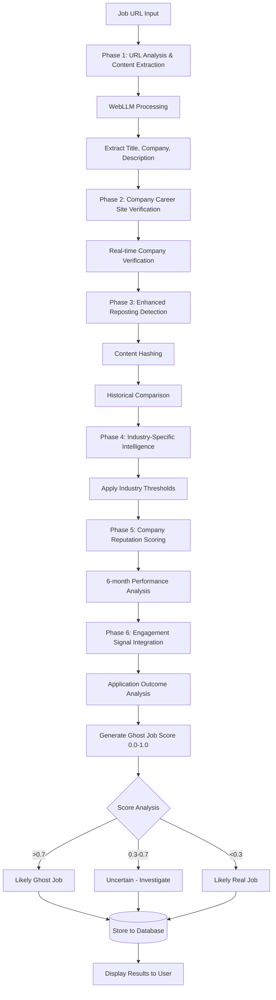
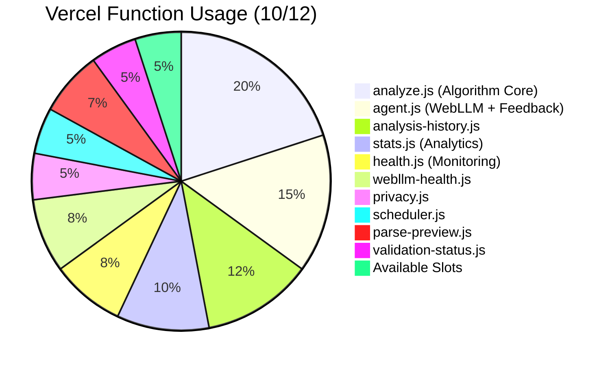
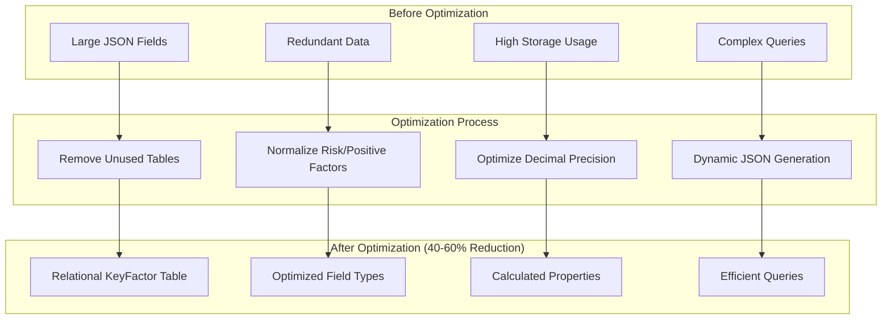
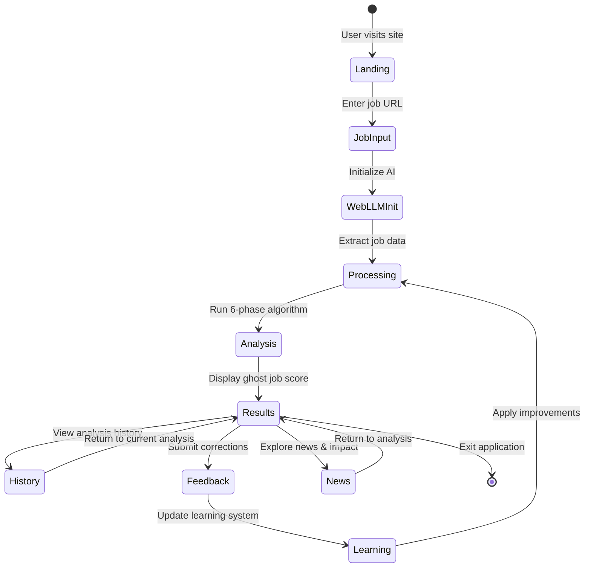

# Ghost Job Detector - Architecture Diagrams

**Version**: v0.1.8  
**Status**: ✅ Production Deployed  
**Updated**: December 15, 2024

---

## 🎯 System Overview Diagram

```mermaid
graph TB
    subgraph "Client Browser"
        UI[React App + TypeScript]
        WebLLM[WebLLM Engine<br/>Llama-3.1-8B-Instruct]
        Cache[Browser Cache]
        
        UI --> WebLLM
        WebLLM --> Cache
    end
    
    subgraph "Vercel Edge Network"
        Edge[Edge Functions]
        CDN[Static Asset CDN]
    end
    
    subgraph "Vercel Serverless (10/12 functions)"
        Analyze[/api/analyze.js<br/>Algorithm Core v0.1.8]
        Agent[/api/agent.js<br/>WebLLM Fallback]
        History[/api/analysis-history.js]
        Stats[/api/stats.js]
        Health[/api/health.js]
        WebLLMHealth[/api/webllm-health.js]
        Privacy[/api/privacy.js]
        Scheduler[/api/scheduler.js]
        ParsePreview[/api/parse-preview.js]
        ValidationStatus[/api/validation-status.js]
    end
    
    subgraph "Database Layer"
        DB[(PostgreSQL<br/>Neon)]
        Redis[(Redis Cache)]
    end
    
    UI --> Edge
    Edge --> Analyze
    Edge --> Agent
    Edge --> History
    Edge --> Stats
    
    Analyze --> DB
    Agent --> DB
    History --> DB
    Stats --> Redis
    
    UI --> CDN
    CDN --> UI
```

---

## 🧠 WebLLM Processing Flow



---

## 🔄 Real-time Learning System

```mermaid
flowchart TD
    subgraph "User Feedback Loop"
        User[User Correction]
        UI[UI Feedback Form]
        Validate[Client Validation]
    end
    
    subgraph "Learning Processing"
        API[/api/agent.js?mode=feedback]
        Parse[Parse Correction Data]
        Store[Store to ParsingCorrection]
        Pattern[Extract Learning Patterns]
    end
    
    subgraph "Pattern Application"
        Service[ParsingLearningService]
        Apply[Apply Learned Patterns]
        Cross[Cross-Session Updates]
    end
    
    subgraph "Database"
        PC[(ParsingCorrection Table)]
        JL[(JobListing Table)]
    end
    
    User --> UI
    UI --> Validate
    Validate --> API
    API --> Parse
    Parse --> Store
    Store --> PC
    Store --> Pattern
    Pattern --> Service
    Service --> Apply
    Apply --> Cross
    Cross --> JL
    
    PC -.->|Real-time Query| Service
    JL -.->|Pattern Matching| Service
```

---

## 📊 Database Architecture (Phase 2 Optimized)



---

## 🚀 Deployment Architecture



---

## 📈 Algorithm Processing Flow (6-Phase)



---

## 🔧 Function Usage Distribution (10/12 Used)



---

## 💾 Storage Optimization (Phase 2)



---

## 📱 User Interface Flow



---

## 🔍 Performance Monitoring

```mermaid
graph TB
    subgraph "Frontend Metrics"
        WebVitals[Web Vitals]
        LoadTime[Page Load Time]
        WebLLMTime[WebLLM Init Time]
    end
    
    subgraph "API Performance" 
        ResponseTime[API Response Time]
        Throughput[Request Throughput]
        ErrorRate[Error Rate]
    end
    
    subgraph "Database Performance"
        QueryTime[Query Response Time]
        ConnPool[Connection Pool Usage]
        StorageGrowth[Storage Growth Rate]
    end
    
    subgraph "WebLLM Performance"
        ModelLoad[Model Load Time]
        InferenceTime[Inference Time]
        GPUUsage[GPU Memory Usage]
    end
    
    subgraph "Monitoring Dashboard"
        Health[/api/health.js]
        WebLLMHealth[/api/webllm-health.js]
        ValidationStatus[/api/validation-status.js]
    end
    
    WebVitals --> Health
    LoadTime --> Health  
    WebLLMTime --> WebLLMHealth
    ResponseTime --> ValidationStatus
    Throughput --> ValidationStatus
    ErrorRate --> Health
    QueryTime --> ValidationStatus
    ConnPool --> Health
    StorageGrowth --> ValidationStatus
    ModelLoad --> WebLLMHealth
    InferenceTime --> WebLLMHealth
    GPUUsage --> WebLLMHealth
```

---

## Summary

These architecture diagrams provide comprehensive visual documentation for:

- **System Overview**: High-level component relationships
- **Processing Flows**: Detailed sequence of operations  
- **Database Design**: Optimized relational structure
- **Deployment Pipeline**: Production deployment workflow
- **Performance Monitoring**: Health check and metrics system

The diagrams complement the textual architecture documentation and provide visual references for developers, operations teams, and stakeholders.