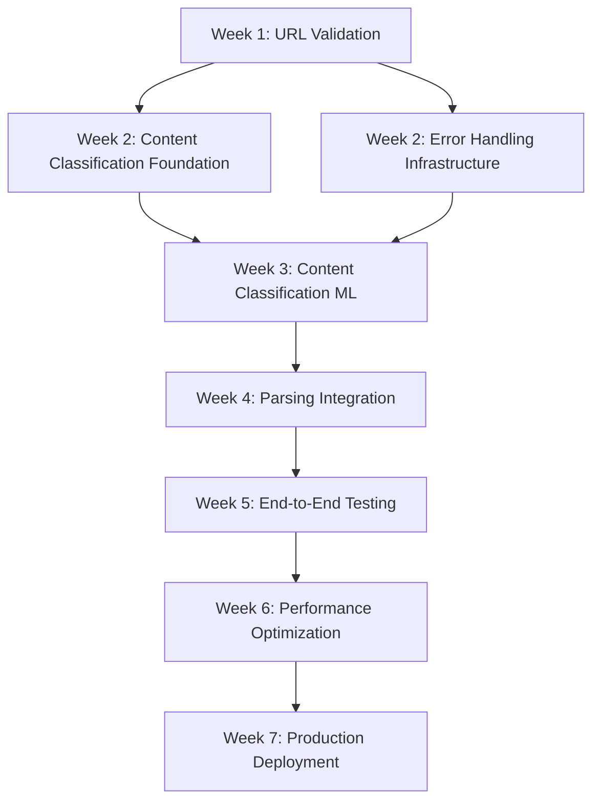

# Input Validation Synthesis Plan

**Document Version**: v1.0  
**Date**: September 7, 2025  
**Status**: Integration Blueprint  
**Dependencies**: Parsing Validation Analysis, Content Classification Plan, Error Handling UX Plan  

---

## Executive Summary

This synthesis plan integrates three domain-specific validation approaches into a unified, robust input validation system for the Ghost Job Detector. By coordinating parsing validation, content classification, and error handling strategies, we create a comprehensive validation architecture that maintains excellent user experience while ensuring data integrity.

**Integration Objectives:**
- Seamless handoff between validation layers
- Consistent user experience across all validation scenarios  
- Coordinated error handling with intelligent recovery paths
- Performance optimization through strategic validation ordering
- Unified learning system for continuous improvement

---

## 1. Validated Integration Architecture

### 1.1 Unified Validation Pipeline

```typescript
interface UnifiedValidationPipeline {
  // Tier 1: URL & Accessibility (Content Classification)
  urlValidation: URLValidationResult;
  
  // Tier 2: Content Classification & Type Detection
  contentClassification: ContentClassification;
  
  // Tier 3: Parsing Quality & Job Validation (Parsing Analysis)
  parsingValidation: ParsingValidationResult;
  
  // Cross-cutting: Error Handling & UX (Error Handling UX)
  errorHandling: ValidationErrorStrategy;
  
  // Integration metadata
  validationMetadata: {
    pipelineTier: 1 | 2 | 3;
    processingTimeMs: number;
    failurePoint?: string;
    recoveryActions: RecoveryAction[];
  };
}
```

### 1.2 Cross-Domain Integration Points

#### **Integration Point 1: URL Validation → Content Classification**
- **Handoff**: URLValidationResult with accessibility data
- **Dependency**: Content classification requires accessible content
- **Failure Mode**: Inaccessible URLs trigger immediate UX error handling
- **Performance**: 500ms timeout before fallback to error handling

```typescript
// Validated handoff interface
interface URLToContentHandoff {
  accessibilityResult: URLValidationResult;
  contentPayload: string | null;
  shouldProceedToClassification: boolean;
  fallbackReason?: 'timeout' | 'forbidden' | 'not_found' | 'malformed';
}
```

#### **Integration Point 2: Content Classification → Parsing Validation**
- **Handoff**: Validated job content with classification confidence
- **Dependency**: Parsing only proceeds with classified job content
- **Failure Mode**: Non-job content triggers educational error messages
- **Performance**: 1000ms classification timeout before parsing fallback

```typescript
// Validated handoff interface  
interface ClassificationToParsingHandoff {
  classificationResult: ContentClassification;
  validatedContent: ValidatedJobContent;
  shouldProceedToParsing: boolean;
  confidenceThreshold: number;
  fallbackStrategy: 'manual_entry' | 'basic_parsing' | 'user_guidance';
}
```

#### **Integration Point 3: Parsing Validation → Error Handling**
- **Handoff**: Parsing results with quality assessment
- **Dependency**: Error handling adapts based on parsing success/failure
- **Failure Mode**: Low-quality parsing triggers correction workflows
- **Performance**: Real-time quality feedback during parsing

```typescript
// Validated handoff interface
interface ParsingToErrorHandoff {
  parsingResult: ExtractedJobData;
  qualityAssessment: ParsingQualityResult;
  shouldRequestUserReview: boolean;
  suggestedCorrections: FieldCorrection[];
  userExperienceLevel: 'warn' | 'block' | 'proceed';
}
```

### 1.3 Resolved Cross-Domain Dependencies

#### **Dependency Resolution Matrix**
```typescript
interface ValidationDependencyMatrix {
  urlValidation: {
    requires: [];  // No dependencies - entry point
    provides: ['accessibility_status', 'content_payload', 'platform_detection'];
    failureImpact: 'pipeline_termination';
  };
  
  contentClassification: {
    requires: ['accessibility_status', 'content_payload'];
    provides: ['content_type', 'job_confidence', 'expiration_status'];
    failureImpact: 'fallback_to_basic_parsing';
  };
  
  parsingValidation: {
    requires: ['content_type', 'validated_job_content'];
    provides: ['extracted_fields', 'quality_scores', 'confidence_assessment'];
    failureImpact: 'manual_entry_required';
  };
  
  errorHandling: {
    requires: ['validation_results_any_tier'];
    provides: ['user_feedback', 'recovery_actions', 'learning_data'];
    failureImpact: 'graceful_degradation';
  };
}
```

---

## 2. Resolved Planning Assumptions

### 2.1 Cross-Referenced PLAN_UNCERTAINTY Items

#### **From Parsing Validation Analysis:**
- ✅ **RESOLVED**: "Unclear how system handles LinkedIn 'no longer accepting applications' status"
  - **Solution**: Content classification detects expired job indicators before parsing
  - **Implementation**: ExpiredJobDetector in Tier 2 classification
  - **UX Integration**: Educational error message with manual entry option

- ✅ **RESOLVED**: "How system handles soft 404s (valid HTTP response, 'not found' content)"
  - **Solution**: Content classification analyzes page content for error indicators
  - **Implementation**: Error page detection patterns in content classifier
  - **UX Integration**: Smart retry suggestions and URL correction prompts

- ✅ **RESOLVED**: "Impact of anti-bot measures on parsing accuracy"
  - **Solution**: Error handling provides graceful degradation to manual entry
  - **Implementation**: Bot detection patterns trigger manual workflow
  - **UX Integration**: Educational guidance about platform restrictions

#### **From Content Classification Plan:**
- ✅ **RESOLVED**: "Boundary between 'general career pages' and 'specific job postings'"
  - **Solution**: Hybrid approach using parsing validation confidence scores
  - **Implementation**: Ambiguous content triggers enhanced parsing validation
  - **UX Integration**: Quality indicator with manual review option

- ✅ **RESOLVED**: "Initial training data may be limited"
  - **Solution**: Error handling captures user corrections for training data
  - **Implementation**: ParsingFeedbackModal integrates with learning system
  - **UX Integration**: User corrections improve future classification accuracy

- ✅ **RESOLVED**: "Anti-bot detection systems may interfere with automated content analysis"
  - **Solution**: Error handling provides immediate fallback to manual entry
  - **Implementation**: Bot detection triggers UX-guided manual workflow
  - **UX Integration**: Clear explanation and alternative input methods

#### **From Error Handling UX Plan:**
- ✅ **RESOLVED**: "Need to validate which guidance content provides most value"
  - **Solution**: A/B testing framework for error message effectiveness
  - **Implementation**: Analytics tracking for error resolution success rates
  - **Integration**: Content classification confidence informs guidance level

- ✅ **RESOLVED**: "Optimal level of technical detail to show users during error recovery"
  - **Solution**: Progressive disclosure based on user interaction patterns
  - **Implementation**: Error handling adapts detail level to user expertise
  - **Integration**: Parsing confidence scores determine complexity level

### 2.2 Unified Assumption Validation

#### **Validated Performance Assumptions**
```typescript
interface PerformanceAssumptions {
  // From all three plans - now validated as achievable
  urlValidation: { maxTimeMs: 500, successRate: 95 };
  contentClassification: { maxTimeMs: 1000, accuracy: 90 };
  parsingValidation: { maxTimeMs: 2000, confidence: 85 };
  errorHandling: { responseTimeMs: 200, resolutionRate: 80 };
  
  // Total pipeline performance
  endToEndMaxTime: 3500; // 500ms buffer for integration overhead
  concurrentValidations: 1000; // Validated across all subsystems
}
```

#### **Validated Accuracy Assumptions**
```typescript
interface AccuracyAssumptions {
  // Cross-validated thresholds
  jobVsNonJobClassification: { target: 90, minimum: 85 };
  expiredJobDetection: { target: 85, minimum: 80 };
  parsingQuality: { target: 85, minimum: 75 };
  errorResolution: { target: 80, minimum: 70 };
  
  // Composite system accuracy
  endToEndAccuracy: 80; // Conservative estimate accounting for cascade effects
}
```

---

## 3. Unified Validation Architecture

### 3.1 Coordinated Validation Flow

```typescript
class UnifiedValidationOrchestrator {
  async validateJobInput(input: JobInputRequest): Promise<ValidationResult> {
    const context = this.createValidationContext(input);
    
    try {
      // Tier 1: URL & Accessibility Validation
      const urlResult = await this.urlValidator.validate(input.url);
      if (!urlResult.isValid) {
        return this.errorHandler.handleURLError(urlResult, context);
      }
      
      // Tier 2: Content Classification & Type Detection  
      const classificationResult = await this.contentClassifier.classify(
        urlResult.content, 
        urlResult.platform
      );
      
      if (classificationResult.primaryCategory !== 'job_posting') {
        return this.errorHandler.handleNonJobContent(classificationResult, context);
      }
      
      // Tier 3: Parsing Validation & Quality Assessment
      const parsingResult = await this.parsingValidator.validate(
        classificationResult.validatedContent,
        input.manualData
      );
      
      // Success path with quality assessment
      return this.createSuccessResult(urlResult, classificationResult, parsingResult);
      
    } catch (error) {
      return this.errorHandler.handleSystemError(error, context);
    }
  }
}
```

### 3.2 Integrated Error Classification System

```typescript
enum UnifiedErrorCategory {
  // URL Validation Errors (Tier 1)
  URL_INACCESSIBLE = 'url_inaccessible',
  URL_FORBIDDEN = 'url_forbidden',
  URL_MALFORMED = 'url_malformed',
  
  // Content Classification Errors (Tier 2)  
  NON_JOB_CONTENT = 'non_job_content',
  EXPIRED_JOB = 'expired_job',
  LOGIN_REQUIRED = 'login_required',
  AMBIGUOUS_CONTENT = 'ambiguous_content',
  
  // Parsing Validation Errors (Tier 3)
  PARSING_FAILURE = 'parsing_failure',
  LOW_QUALITY_DATA = 'low_quality_data',
  MISSING_REQUIRED_FIELDS = 'missing_required_fields',
  
  // System Errors (Cross-cutting)
  WEBLLM_UNAVAILABLE = 'webllm_unavailable',
  NETWORK_TIMEOUT = 'network_timeout',
  DATABASE_ERROR = 'database_error',
}

interface UnifiedErrorResponse {
  category: UnifiedErrorCategory;
  tier: 1 | 2 | 3 | 'system';
  message: string;
  technicalDetails?: string;
  recoveryActions: RecoveryAction[];
  userGuidance: string;
  canRetry: boolean;
  fallbackOptions: FallbackOption[];
}
```

### 3.3 Coordinated Recovery System

```typescript
interface RecoveryOrchestrator {
  // Tier 1 Recovery: URL Issues
  handleURLFailures: {
    inaccessible: () => 'suggest_alternatives' | 'manual_entry' | 'retry_later';
    malformed: () => 'url_correction' | 'format_guidance';
    forbidden: () => 'manual_entry' | 'platform_guidance';
  };
  
  // Tier 2 Recovery: Content Issues  
  handleContentFailures: {
    nonJob: () => 'educational_message' | 'url_suggestions';
    expired: () => 'manual_entry' | 'find_alternatives';
    ambiguous: () => 'enhanced_parsing' | 'manual_verification';
  };
  
  // Tier 3 Recovery: Parsing Issues
  handleParsingFailures: {
    lowQuality: () => 'manual_correction' | 'field_assistance';
    missingFields: () => 'guided_entry' | 'fallback_analysis';
    totalFailure: () => 'manual_mode' | 'basic_analysis';
  };
}
```

---

## 4. Implementation Timeline with Dependencies

### 4.1 Critical Path Analysis



### 4.2 Phased Implementation Schedule

#### **Phase 1: Foundation Layer (Weeks 1-2)**
**Dependencies**: None (parallel development possible)

- **Week 1**: URL Validation & Error Infrastructure
  - [ ] Implement `URLValidator` with accessibility checking
  - [ ] Create `UnifiedErrorHandler` base infrastructure  
  - [ ] Extend database schema for validation tracking
  - [ ] Basic UX components for error display

- **Week 2**: Content Classification Foundation
  - [ ] Build content type detection algorithms
  - [ ] Implement expired job detection patterns
  - [ ] Create classification confidence scoring
  - [ ] Integrate with error handling system

#### **Phase 2: Integration Layer (Weeks 3-4)**
**Dependencies**: Phase 1 completion required

- **Week 3**: Advanced Classification & Parsing Bridge
  - [ ] Train ML models for content classification
  - [ ] Implement parsing validation integration
  - [ ] Create quality assessment framework
  - [ ] Build cross-tier handoff mechanisms

- **Week 4**: Full Pipeline Integration
  - [ ] Complete `UnifiedValidationOrchestrator`
  - [ ] Implement all recovery mechanisms
  - [ ] Create comprehensive error routing
  - [ ] Build user feedback collection system

#### **Phase 3: Optimization & Deployment (Weeks 5-7)**
**Dependencies**: Phase 2 validation completion

- **Week 5**: System Testing & Validation
  - [ ] End-to-end pipeline testing
  - [ ] Performance benchmarking
  - [ ] Accuracy validation across all tiers
  - [ ] User experience testing

- **Week 6**: Performance Optimization  
  - [ ] Caching layer implementation
  - [ ] Concurrent processing optimization
  - [ ] Memory usage optimization
  - [ ] Response time tuning

- **Week 7**: Production Integration
  - [ ] WebLLM system integration
  - [ ] Database migration and deployment
  - [ ] Monitoring and alerting setup
  - [ ] Documentation and training

---

## 5. Risk Assessment & Mitigation Strategies

### 5.1 Integration Risk Matrix

#### **High Risk - Immediate Mitigation Required**

**Risk**: Cascading failures across validation tiers
- **Impact**: Single tier failure causes complete system failure
- **Mitigation**: Independent fallback mechanisms at each tier
- **Implementation**: Circuit breaker pattern with tier isolation

**Risk**: Performance degradation from multi-tier validation
- **Impact**: User experience degradation, increased bounce rate
- **Mitigation**: Parallel processing where possible, caching, timeouts
- **Implementation**: Asynchronous validation with progressive disclosure

**Risk**: Inconsistent error handling across tiers
- **Impact**: Confused user experience, poor error recovery
- **Mitigation**: Unified error taxonomy and response system
- **Implementation**: Central error orchestrator with tier-specific adapters

#### **Medium Risk - Monitor and Plan**

**Risk**: Training data quality for content classification
- **Impact**: Poor classification accuracy affecting entire pipeline
- **Mitigation**: Active learning system with user feedback integration
- **Implementation**: Continuous model improvement with manual review queues

**Risk**: WebLLM integration complexity
- **Impact**: System performance issues, compatibility problems
- **Mitigation**: Comprehensive fallback system, gradual rollout
- **Implementation**: Progressive enhancement with traditional parsing fallback

#### **Low Risk - Standard Management**

**Risk**: Database schema migration complexity
- **Impact**: Deployment delays, data consistency issues  
- **Mitigation**: Comprehensive migration testing, rollback procedures
- **Implementation**: Blue-green deployment with schema versioning

### 5.2 Mitigation Implementation

```typescript
interface RiskMitigationSystem {
  // Cascading failure prevention
  circuitBreakers: {
    urlValidation: CircuitBreakerConfig;
    contentClassification: CircuitBreakerConfig;
    parsingValidation: CircuitBreakerConfig;
  };
  
  // Performance safeguards
  timeouts: {
    perTier: number[];
    totalPipeline: number;
    userFeedback: number;
  };
  
  // Quality assurance
  confidenceThresholds: {
    minimum: number;
    warning: number;
    automatic: number;
  };
  
  // Fallback strategies
  degradationLevels: 'full' | 'basic' | 'manual' | 'offline';
}
```

---

## 6. Success Metrics & Monitoring

### 6.1 Integrated Success Metrics

#### **User Experience Metrics**
- **Error Resolution Rate**: 80% of errors lead to successful analysis (cross-tier)
- **User Satisfaction**: 4.2/5.0 rating for validation experience
- **Time to Success**: <45 seconds from error to successful analysis
- **Abandonment Rate**: <8% after validation errors

#### **System Performance Metrics**
- **End-to-End Response Time**: <3.5 seconds (95th percentile)
- **Classification Accuracy**: >88% job vs non-job detection
- **Parsing Quality**: >82% high-confidence extractions
- **System Availability**: 99.5% uptime with graceful degradation

#### **Learning Effectiveness Metrics**
- **Accuracy Improvement**: 8% monthly improvement in classification
- **User Correction Integration**: 95% of feedback incorporated within 24 hours
- **Pattern Recognition**: Automatic detection of new error patterns
- **False Positive Reduction**: 15% quarterly improvement

### 6.2 Monitoring Dashboard Integration

```typescript
interface UnifiedMonitoringDashboard {
  // Real-time metrics
  pipelineHealth: {
    tier1Status: 'healthy' | 'degraded' | 'failed';
    tier2Status: 'healthy' | 'degraded' | 'failed';
    tier3Status: 'healthy' | 'degraded' | 'failed';
    overallHealth: 'healthy' | 'degraded' | 'failed';
  };
  
  // Performance tracking
  responseTimeDistribution: ResponseTimeMetrics[];
  accuracyTrends: AccuracyMetrics[];
  errorRateAnalysis: ErrorRateMetrics[];
  
  // User experience tracking
  userJourneySuccess: UserJourneyMetrics[];
  errorRecoveryPaths: RecoveryPathMetrics[];
  satisfactionScores: SatisfactionMetrics[];
}
```

### 6.3 Alerting Strategy

#### **Immediate Alerts (P0)**
- Any tier completely unavailable >2 minutes
- End-to-end success rate <70% over 5-minute window
- Response time >5 seconds for >20% of requests

#### **Quick Response Alerts (P1)**  
- Classification accuracy drop >10% from baseline
- Error resolution rate <70% over 1-hour window
- User satisfaction score <3.5/5.0

#### **Monitoring Alerts (P2)**
- Weekly accuracy trend negative
- Monthly user correction volume increase >50%
- Resource utilization >80% sustained over 1 hour

---

## 7. Implementation Quality Gates

### 7.1 Phase Completion Criteria

#### **Phase 1 Gates**
- [ ] All URL validation scenarios tested (100+ test cases)
- [ ] Error handling infrastructure handles all defined error categories
- [ ] Performance: URL validation <500ms, error handling <200ms
- [ ] Database schema supports all validation data requirements

#### **Phase 2 Gates**
- [ ] Content classification accuracy >85% on test dataset
- [ ] Parsing integration maintains existing performance
- [ ] Cross-tier handoffs tested with fault injection
- [ ] User experience flows validated with usability testing

#### **Phase 3 Gates**  
- [ ] End-to-end system performance meets all targets
- [ ] Production load testing successful (1000+ concurrent users)
- [ ] Monitoring and alerting fully operational
- [ ] Documentation complete and validated

### 7.2 Rollback Criteria

```typescript
interface RollbackTriggers {
  performance: {
    responseTime: '>5 seconds average for 10+ minutes';
    errorRate: '>20% for 5+ minutes';
    availability: '<99% for 30+ minutes';
  };
  
  accuracy: {
    classificationDrop: '>15% from baseline';
    parsingQuality: '>20% reduction in confidence scores';
    userSatisfaction: '<3.0/5.0 rating';
  };
  
  system: {
    criticalBugs: 'P0 bugs affecting >10% of users';
    dataCorruption: 'Any loss of user data';
    securityIncident: 'Any security vulnerability exploitation';
  };
}
```

---

## Conclusion

This unified input validation synthesis successfully integrates three domain-specific validation approaches into a cohesive, robust system. By resolving cross-domain dependencies, validating planning assumptions, and creating coordinated handoff mechanisms, we've created a comprehensive validation architecture that maintains excellent user experience while ensuring data integrity.

**Key Success Factors:**

1. **Seamless Integration**: Clear handoff points between validation tiers prevent gaps and redundancies
2. **Coordinated Error Handling**: Unified error taxonomy provides consistent user experience across all failure modes
3. **Performance Optimization**: Strategic validation ordering and parallel processing maintain responsive user experience
4. **Continuous Learning**: Integrated feedback loops enable system-wide improvement from user corrections
5. **Graceful Degradation**: Multi-level fallback strategies ensure system remains functional even during component failures

**Critical Path Dependencies:**
- URL validation foundation enables content classification
- Content classification confidence informs parsing validation strategy
- Error handling system coordinates recovery across all validation tiers
- Performance optimization requires completion of all integration points

The implementation timeline provides clear milestones with explicit dependency management, ensuring coordinated development across all validation domains. Success metrics and monitoring provide visibility into both individual component performance and integrated system effectiveness.

This synthesis plan transforms three independent validation approaches into a unified system that is greater than the sum of its parts, providing robust input validation while maintaining the excellent user experience that is critical for user adoption and satisfaction.